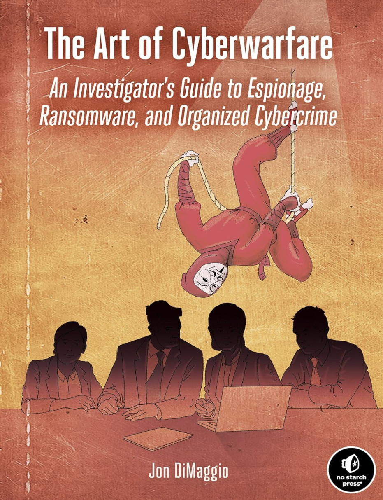

# Oh, hi 👋

I'm Tracie, a red teamer-in-training with a soft spot for seconds chances, breaking things responsibly, and cats who help me hack.

🪄 To sharpen my offensive security skills (and stay sane during the job hunt), I am creating my own 40-day hands-on, security training series.

🤓 My lab setup inclues Kali, Metasploitable2, and DVWA.

🖖 I'm currently digging into Burp Suite (Community Edition), FFUF, Gobuster, SQL injection techniques, and other fundamentals of web app exploitation.

🪅 I keep daily(ish) logs and red team-style notes in a public GitHub repo. Check it out [here](https://github.com/cyberTwitty/RedTeamFromScratch)! They're part study guide, part documentation experiment, and part open notes for anyone else figuring this stuff out from scratch like I am.

    

---

  
  
  
  
  
  
  
  

### 📚 Currently Reading

    <table>
        <tr>
            <td>
                
            </td>
            <td>
                
            </td>
            <td>
                
            </td>
        </tr>
        <tr align="center">
            <td><em>She-Wolves</em> Paulina Bren</td>
            <td><em>How to Think Like Socrates</em> Donald J. Robertson</td>
            <td><em>The Art of Cyberwarfare</em> Jon DiMaggio</td>
        </tr>
    </table>

